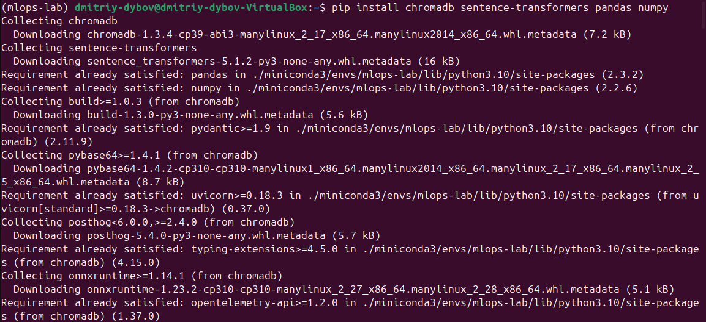

# МИНИCTEPCTBO НАУКИ И ВЫСШЕГО ОБРАЗОВАНИЯ РОССИЙСКОЙ ФЕДЕРАЦИИ
## Федеральное государственное автономное образовательное учреждение высшего образования «Северо-Кавказский федеральный университет» Институт перспективной инженерии

### Отчет по лабораторной работе 3
### Работа с векторными (ChromaDB) и графовыми (Neo4j) базами данных
Дата: 2025-11-18 \
Семестр: [2 курс 1 полугодие - 3 семестр] \
Группа: ПИН-м-о-24-1 \
Дисциплина: Технологии программирования \
Студент: Дыбов Д.В.
#### Цель работы
Освоение базовых принципов работы с векторными базами данных на примере ChromaDB и графовыми базами данных на примере Neo4j. Получение практических навыков создания коллекций, генерации эмбеддингов, выполнения семантического поиска и интеграции с ML-моделями; создания узлов и связей, выполнения запросов на языке Cypher и визуализации графовых структур.
#### Теоретическая часть
Краткие изученные концепции:
- Векторные базы данных (ChromaDB): коллекции, эмбеддинги, семантический поиск, хранение метаданных.
- Модели эмбеддингов: принцип работы sentence-transformers, важность версионности и нормализации.
- Графовые базы данных (Neo4j): узлы, отношения, свойства, модель данных Property Graph.
- Язык запросов Cypher: MATCH, CREATE, MERGE, RETURN, работу с ограничениями и индексами.
- Интеграция с ML: генерация эмбеддингов, сохранение их в векторной БД, семантический поиск как этап пайплайна.
#### Практическая часть
##### Выполненные задачи
- [x] Установлены пакеты chromadb, sentence-transformers, pandas, numpy.
- [x] Создана рабочая директория и добавлен файл chroma_demo.py для работы с ChromaDB.
- [x] Наполнен файл chroma_demo.py и запущен скрипт; проверен результат семантического поиска.
- [x] Запущен контейнер Neo4j и проверена работоспособность.
- [x] Открыт веб-интерфейс Neo4j по адресу http://localhost:7474; выполнён вход.
- [x] Создан и запущен файл neo4j_demo.py; выполнен запрос MATCH (n) RETURN n LIMIT 25 и произведена визуализация графа.
- [x] Остановлен контейнер Neo4j.

##### Ключевые фрагменты кода
- Скрипт chromo_demo.py:
```python
import chromadb
from sentence_transformers import SentenceTransformer
import pandas as pd
import numpy as np
from typing import List, Dict

model = SentenceTransformer('all-MiniLM-L6-v2')
print("Модель для эмбеддингов загружена")

client = chromadb.Client()
collection = client.create_collection(
    name="documents_collection",
    metadata={"hnsw:space": "cosine"}  # Использование косинусного расстояния
)
print("Коллекция создана")

documents = [
"Машинное обучение - это область искусственного интеллекта",
"Глубокое обучение использует нейронные сети с множеством слоев",
"Трансформеры revolutionized обработку естественного языка",
"BERT является популярной моделью для понимания текста",
"GPT модели используются для генерации текста",
"Векторные базы данных хранят embeddings для семантического поиска",
"ChromaDB - это open-source векторная база данных",
"Semantic search позволяет находить документы по смыслу",
"Neural networks inspired биологическими нейронными сетями",
"Natural Language Processing обрабатывает человеческий язык"
]
metadata = [{"category": "AI", "source": "educational"} for _ in
range(len(documents))]
ids = [f"doc_{i}" for i in range(len(documents))]
print(f"Подготовлено {len(documents)} документов")

embeddings = model.encode(documents).tolist()
collection.add(
    documents=documents,
    embeddings=embeddings,
    metadatas=metadata,
    ids=ids
)
print("Документы добавлены в коллекцию")

def semantic_search(query: str, n_results: int = 3):
    query_embedding = model.encode([query]).tolist()
    results = collection.query(
        query_embeddings=query_embedding,
        n_results=n_results,
        include=["documents", "distances", "metadatas"]
    )
    return results

test_queries = [
"искусственный интеллект",
"нейронные сети",
"обработка текста",
"базы данных"
]
print("\nРезультаты семантического поиска:")
for query in test_queries:
    print(f"\nЗапрос: '{query}'")
    results = semantic_search(query)
    for i, (doc, distance) in enumerate(zip(results['documents'][0],
    results['distances'][0])):
        print(f"{i+1}. {doc} (расстояние: {distance:.4f})")

def filtered_search(query: str, filter_dict: Dict, n_results: int = 2):
    query_embedding = model.encode([query]).tolist()
    results = collection.query(
        query_embeddings=query_embedding,
        n_results=n_results,
        where=filter_dict,
        include=["documents", "distances", "metadatas"]
    )
    return results
    
print("\n\nПоиск с фильтрацией по категории:")
results = filtered_search(
    "модели машинного обучения",
    {"category": "AI"},
    n_results=2
)
for i, (doc, distance) in enumerate(zip(results['documents'][0],
results['distances'][0])):
    print(f"{i+1}. {doc} (расстояние: {distance:.4f})")

print(f"\nИнформация о коллекции:")
print(f"Количество документов: {collection.count()}")
sample_docs = collection.get(ids=["doc_0", "doc_1"])
print("\nПримеры документов:")
for doc in sample_docs['documents']:
    print(f"- {doc}")

persistent_client = chromadb.PersistentClient(path="./chroma_db")
persistent_collection = persistent_client.create_collection(
    name="persistent_docs",
    metadata={"hnsw:space": "cosine"}
)
persistent_collection.add(
    documents=documents[:5],  # Первые 5 документов
    embeddings=embeddings[:5],
    metadatas=metadata[:5],
    ids=ids[:5]
)
print("Персистентная коллекция создана и заполнена")
loaded_collection = persistent_client.get_collection("persistent_docs")
print(f"Загружено документов: {loaded_collection.count()}")

def create_news_collection():
    news_data = [
"Рынок акций вырос на 2% сегодня",
"Новая технология в области искусственного интеллекта представлена",
"Криптовалюты показывают волатильность на рынке",
"Ученые сделали breakthrough в квантовых вычислениях",
"Центральные банки обсуждают monetary policy"
    ]
    news_metadata = [
        {"category": "finance", "date": "2024-01-15"},
        {"category": "technology", "date": "2024-01-15"},
        {"category": "crypto", "date": "2024-01-14"},
        {"category": "science", "date": "2024-01-14"},
        {"category": "economics", "date": "2024-01-13"}
    ]
    news_ids = [f"news_{i}" for i in range(len(news_data))]
    news_embeddings = model.encode(news_data).tolist()
    news_collection = client.create_collection(name="news_collection")
    news_collection.add(
        documents=news_data,
        embeddings=news_embeddings,
        metadatas=news_metadata,
        ids=news_ids
    )
    return news_collection

news_coll = create_news_collection()
results = news_coll.query(
    query_embeddings=model.encode(["финансовые новости"]).tolist(),
    n_results=2
)
print("\nПоиск в новостной коллекции:")
for doc in results['documents'][0]:
    print(f"- {doc}")
```
- Скрипт neo4j_demo.py:
```python
from neo4j import GraphDatabase 
import pandas as pd 
from typing import Dict 

URI = "bolt://localhost:7687" 
AUTH = ("neo4j", "password123") 
driver = GraphDatabase.driver(URI, auth=AUTH)

def test_connection(): 
    with driver.session() as session: 
        result = session.run("RETURN 'Connected to Neo4j' AS message") 
        return result.single()["message"] 

print(test_connection())


def create_knowledge_graph(tx): 
    # Очистка базы данных 
    tx.run("MATCH (n) DETACH DELETE n") 
    # Создание узлов (сущностей) 
    query = """ 
    CREATE  
    (ai:Domain {name: 'Artificial Intelligence'}), 
    (ml:Technology {name: 'Machine Learning', type: 'ML'}), 
    (dl:Technology {name: 'Deep Learning', type: 'DL'}), 
    (nlp:Technology {name: 'NLP', type: 'NLP'}), 
    (bert:Model {name: 'BERT', developer: 'Google'}), 
    (gpt:Model {name: 'GPT', developer: 'OpenAI'}), 
    (python:Language {name: 'Python', paradigm: 'multi-paradigm'}), 
    (pytorch:Framework {name: 'PyTorch', language: 'Python'}), 
    (tf:Framework {name: 'TensorFlow', language: 'Python'}), 
    // Создание связей 
    (ai)-[:INCLUDES]->(ml), 
    (ai)-[:INCLUDES]->(nlp), 
    (ml)-[:CONTAINS]->(dl), 
    (nlp)-[:USES]->(bert), 
    (nlp)-[:USES]->(gpt), 
    (ml)-[:IMPLEMENTED_IN]->(python), 
    (dl)-[:FRAMEWORK]->(pytorch), 
    (dl)-[:FRAMEWORK]->(tf), 
    (bert)-[:BUILT_WITH]->(tf), 
    (gpt)-[:BUILT_WITH]->(pytorch), 
    (python)-[:HAS_FRAMEWORK]->(pytorch), 
    (python)-[:HAS_FRAMEWORK]->(tf) 
    """ 
    tx.run(query) 

with driver.session() as session: 
    session.execute_write(create_knowledge_graph) 
    print("База знаний создана")


def get_all_nodes(tx): 
    result = tx.run("MATCH (n) RETURN n.name AS name, labels(n) AS labels") 
    return [{"name": record["name"], "labels": record["labels"]} for record in result] 

print("\nВсе узлы в базе:") 
with driver.session() as session:
    nodes = session.execute_read(get_all_nodes) 
for node in nodes: 
    print(f"{node['name']} - {node['labels']}")


def get_relationships(tx): 
    query = """ 
    MATCH (a)-[r]->(b) 
    RETURN a.name AS source, type(r) AS relationship, b.name AS target 
    """ 
    result = tx.run(query) 
    return [{"source": record["source"], "relationship": 
    record["relationship"], "target": record["target"]} for record in result] 

print("\nСвязи в графе:") 
with driver.session() as session:
    relationships = session.execute_read(get_relationships) 
for rel in relationships: 
    print(f"{rel['source']} --{rel['relationship']}--> {rel['target']}")


def find_paths(tx, start_node, end_node): 
    query = """ 
    MATCH path = (a {name: $start_node})-[*]->(b {name: $end_node}) 
    RETURN [node in nodes(path) | node.name] AS path_nodes, 
           [rel in relationships(path) | type(rel)] AS relationships 
    """ 
    result = tx.run(query, start_node=start_node, end_node=end_node) 
    return [{"nodes": record["path_nodes"], "relationships": 
    record["relationships"]} for record in result] 

print("\nПути от AI до BERT:") 
with driver.session() as session:
    paths = session.execute_read(find_paths, "Artificial Intelligence", "BERT") 
for path in paths: 
    print(f"Путь: {' -> '.join(path['nodes'])}")


def analyze_connectivity(tx): 
    query = """ 
    MATCH (n) 
    RETURN n.name AS node,  
           COUNT { (n)--() } AS degree, 
           labels(n)[0] AS type 
    ORDER BY degree DESC 
    """ 
    result = tx.run(query) 
    return [{"node": record["node"], "degree": record["degree"], "type": 
    record["type"]} for record in result] 

print("\nАнализ связности узлов:") 
with driver.session() as session:
    connectivity = session.execute_read(analyze_connectivity) 
for node in connectivity: 
    print(f"{node['node']} ({node['type']}): {node['degree']} связей")


def import_ai_researchers(tx): 
    query = """ 
    LOAD CSV WITH HEADERS FROM 'file:///ai_researchers.csv' AS row 
    CREATE (:Researcher { 
        name: row.name, 
        affiliation: row.affiliation, 
        field: row.field, 
        h_index: toInteger(row.h_index) 
    }) 
    """ 
    tx.run(query) 
    
researchers_data = """name,affiliation,field,h_index 
Yann LeCun,Facebook AI Research,Computer Vision,180 
Andrew Ng,Stanford University,Machine Learning,150 
Yoshua Bengio,MILA,Deep Learning,170 
Geoffrey Hinton,University of Toronto,Neural Networks,200 
Demis Hassabis,Google DeepMind,Reinforcement Learning,80 
""" 
with open("neo4j/import/ai_researchers.csv", "w") as f: 
    f.write(researchers_data)

with driver.session() as session:
    session.execute_write(import_ai_researchers) 
    print("Данные исследователей импортированы")


def connect_researchers_to_domains(tx): 
    query = """ 
    // 1. Связать всех исследователей с доменом AI
    MATCH (r:Researcher), (d:Domain {name: 'Artificial Intelligence'}) 
    CREATE (r)-[:WORKS_IN]->(d) 
    
    WITH 1 AS dummy
    
    // 2. Связать Яна ЛеКуна с Deep Learning
    MATCH (r:Researcher {name: 'Yann LeCun'}), (dl:Technology {name: 'Deep Learning'}) 
    CREATE (r)-[:CONTRIBUTED_TO]->(dl) 
    
    WITH 1 AS dummy2
    
    // 3. Связать Эндрю Нг с Machine Learning
    MATCH (r:Researcher {name: 'Andrew Ng'}), (ml:Technology {name: 'Machine Learning'}) 
    CREATE (r)-[:CONTRIBUTED_TO]->(ml) 
    """ 
    tx.run(query) 

with driver.session() as session: 
    session.execute_write(connect_researchers_to_domains) 
    print("Связи исследователей созданы")
```
- Скрипт export_graph_neo4j.py:
```python

```
##### Результаты выполнения
1. Произведена установка зависимостей pip install chromadb sentence-transformers pandas numpy
 \
Рисунок 1 — Установка пакетов (скриншот).

2. Создана директория проекта; добавлен chroma_demo.py.

Рисунок 2 — Создание рабочей директории.

Реализация chroma_demo.py:

Наполнение скрипта: загрузка текстов, генерация эмбеддингов через sentence-transformers, создание коллекции ChromaDB, вставка объектов, выполнение семантического поиска по запросам.

Рисунок 3 — Фрагменты кода chroma_demo.py.

Запуск chroma_demo.py:

Скрипт выполнен; результаты поиска показали релевантность даже при неточных ключевых словах (примеры: «базы данных», «нейронные сети»).

Рисунок 4 — Результат выполнения кода.

Запуск Neo4j:

Запущен Docker-контейнер Neo4j (порт 7474); проверка работы контейнера.

Рисунок 5 — Запуск Neo4j контейнера.

Подготовка и проверка вспомогательных файлов:

Проверено содержимое fine_turning.py (если использовался) — Рисунок 6.

Работа с Neo4j через веб-интерфейс:

Открыт http://localhost:7474; выполнён вход — Рисунок 7 (страница авторизации), Рисунок 8 (авторизованный вход).

Реализация neo4j_demo.py:

Скрипт создает узлы и связи (например, TECHNOLOGY, RESEARCHER, PAPER, CONTRIBUTED_TO), выполняет вставку данных и простые запросы.

Рисунок 9 — Скрипт neo4j_demo.py; Рисунок 10 — Результат выполнения.

Визуализация графа:

Выполнен запрос MATCH (n) RETURN n LIMIT 25; получены таблицы и визуализация — Рисунок 11 (таблицы), Рисунок 12 (визуализация).

Анализ: граф отображает связи между концепциями ИИ, технологиями и исследователями; отмечена неполнота связей CONTRIBUTED_TO у некоторых исследователей.

Остановка контейнера:

Остановлен Neo4j-контейнер — Рисунок 13.


Результаты выполнения
- Установлены зависимости и подготовлено окружение (скриншоты установки) — Рисунок 1.
- Создано рабочее окружение и файлы проекта — Рисунок 2, Рисунок 3.
- chroma_demo.py выполнил семантический поиск успешно; релевантные результаты для тематических запросов — Рисунок 4.
- Neo4j запущен и доступен через веб-интерфейс; выполнены вставки и запросы, получена визуализация графа — Рисунки 5–12.
- Отмечены недостатки данных: часть исследователей не имеет связи CONTRIBUTED_TO, что снижает полноту графа.
- Контейнер Neo4j остановлен — Рисунок 13.

Тестирование
- [x] Модульные тесты — не применялись.
- [x] Интеграционные тесты — проверены взаимодействия между компонентами (генерация эмбеддингов → запись в ChromaDB; создание/запросы в Neo4j).
- [x] Производительность — не в фокусе данной работы; операции завершились в разумные сроки в тестовой среде.

Выводы
Выполнение лабораторной работы №3 позволило: /
Получить практические навыки работы с векторными БД (ChromaDB): создание коллекций, генерация и запись эмбеддингов, семантический поиск.
Освоить базовые операции с графовой БД (Neo4j): создание узлов и отношений, выполнение запросов на Cypher, визуализацию графовых структур.
Выявить области улучшения: дополнять данные связями CONTRIBUTED_TO, логировать версии моделей эмбеддингов и метаданные коллекций для воспроизводимости.

Приложения и артефакты
chroma_demo.py — скрипт для работы с ChromaDB (в рабочей директории).

neo4j_demo.py — скрипт для работы с Neo4j.

fine_turning.py — вспомогательный файл (при наличии).

Скриншоты и результаты тестов: Рисунок 1..13 (папка report при подготовке отчёта).
